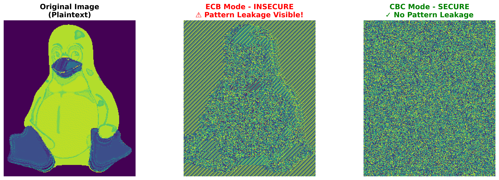
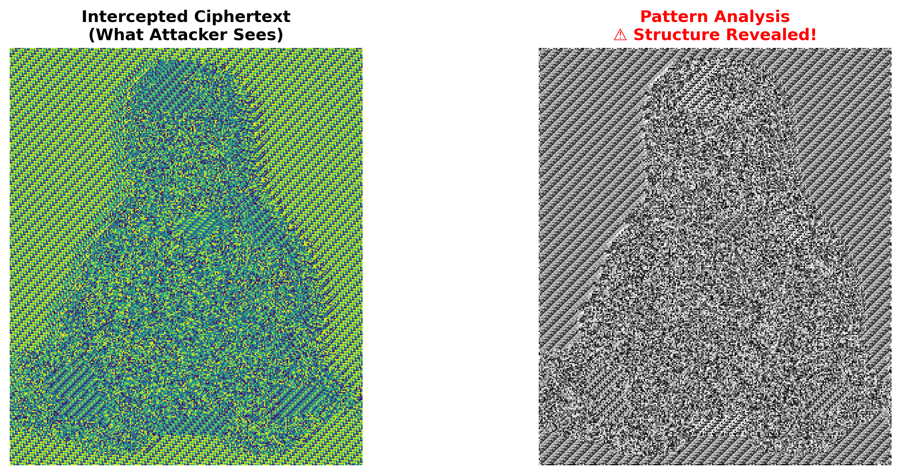

# ICS570 - Lab Week 9: Symmetric Key Encryption Systems

**Implementing and Attacking Symmetric Key Encryption Systems**

A comprehensive implementation demonstrating AES and DES encryption with multiple cipher modes, cryptographic vulnerabilities, and security best practices.

---

## 📋 Table of Contents

- [Overview](#overview)
- [Learning Objectives](#learning-objectives)
- [Project Structure](#project-structure)
- [Setup & Installation](#setup--installation)
- [Usage](#usage)
- [Lab Deliverables](#lab-deliverables)
- [Key Findings](#key-findings)
- [Security Recommendations](#security-recommendations)

---

## 🎯 Overview

This lab project explores symmetric key encryption through practical implementation and security analysis. The project demonstrates:

- **Part 1:** Implementation of AES/DES encryption with multiple cipher modes
- **Part 2:** Security analysis and attack demonstrations (ECB pattern leakage, key reuse)
- **Part 3:** Security best practices and recommendations

### What's Included

✅ Complete encryption/decryption tool supporting AES and DES
✅ Implementation of 5 cipher modes (ECB, CBC, CFB, OFB, CTR)
✅ Image encryption with visual pattern analysis
✅ ECB vulnerability demonstrations
✅ Key reuse attack simulations
✅ Comprehensive security analysis with visualizations
✅ Detailed documentation and reports

---

## 🎓 Learning Objectives

After completing this lab, you will understand:

1. How to implement symmetric key encryption using AES and DES
2. Differences between block cipher modes and their security properties
3. Why ECB mode is fundamentally insecure for structured data
4. How pattern leakage attacks work in practice
5. The importance of proper IV management and key rotation
6. Best practices for secure cryptographic implementations

---

## 📁 Project Structure

```
encryption-decryption/
├── venv/                          # Python virtual environment
├── output/                        # Generated visualizations and results
│   ├── ecb_vulnerability_demo.png
│   ├── ecb_pattern_attack.png
│   ├── key_reuse_analysis.png
│   └── mode_comparison.png
├── crypto_tool.py                 # Core encryption engine
├── image_crypto.py                # Image encryption & visualization
├── crypto_analysis.py             # Attack demonstrations
├── lab_demo.py                    # Complete lab runner
├── plaintext.txt                  # Sample text file
├── Tux.png                        # Test image (Linux penguin)
├── studentdata.csv                # Sample structured data
├── LAB_REPORT.md                  # Comprehensive lab report
├── DELIVERABLE_3_SUMMARY.md       # One-page findings summary
└── README.md                      # This file
```

---

## 🚀 Setup & Installation

### Prerequisites

- Python 3.7 or higher
- pip (Python package manager)

### Installation Steps

1. **Clone or navigate to the project directory:**
   ```bash
   cd encryption-decryption
   ```

2. **Create and activate virtual environment:**
   ```bash
   python3 -m venv venv
   source venv/bin/activate  # On Windows: venv\Scripts\activate
   ```

3. **Install required dependencies:**
   ```bash
   pip install pycryptodome matplotlib numpy pillow
   ```

4. **Verify installation:**
   ```bash
   python3 -c "from Crypto.Cipher import AES; import numpy; import matplotlib; print('✓ All libraries installed')"
   ```

---

## 💻 Usage

### Quick Start - Run Complete Lab Demo

Run the comprehensive demonstration covering all three lab parts:

```bash
source venv/bin/activate
python3 lab_demo.py
```

This will:
- Encrypt/decrypt files with all cipher modes
- Generate visualizations comparing different modes
- Demonstrate ECB vulnerabilities
- Perform key reuse attack analysis
- Output results to `./output/` directory

### Run Individual Components

**1. Test Basic Encryption:**
```bash
python3 crypto_tool.py
```
Tests AES encryption with different modes on sample text.

**2. Image Encryption & Visualization:**
```bash
python3 image_crypto.py
```
Demonstrates ECB pattern leakage with image encryption.

**3. Attack Demonstrations:**
```bash
python3 crypto_analysis.py
```
Runs key reuse vulnerability and ECB pattern attacks.

### Using the CryptoTool API

```python
from crypto_tool import CryptoTool

# Initialize with AES
tool = CryptoTool('AES')

# Generate a key
key = tool.generate_key(passphrase="MySecurePassword")

# Encrypt data
plaintext = b"Secret message"
ciphertext, iv = tool.encrypt(plaintext, key, mode='CBC')

# Decrypt data
decrypted = tool.decrypt(ciphertext, key, mode='CBC', iv=iv)
print(decrypted)  # b"Secret message"

# Encrypt files
tool.encrypt_file('input.txt', 'output.enc', key, mode='CBC')
tool.decrypt_file('output.enc', 'decrypted.txt', key, mode='CBC', iv=iv)
```

### Using the ImageCrypto API

```python
from image_crypto import ImageCrypto

img_crypto = ImageCrypto('AES')
key = img_crypto.crypto.generate_key(passphrase="ImageKey")

# Demonstrate ECB vulnerability
img_crypto.demonstrate_ecb_vulnerability('Tux.png', key, 'output')

# Compare all cipher modes
img_crypto.compare_modes('Tux.png', key, modes=['ECB', 'CBC', 'CTR'])
```

---

## 📦 Lab Deliverables

### ✅ Deliverable 1: Working Encryption/Decryption Tool

**Location:** `crypto_tool.py`, `image_crypto.py`

**Features:**
- ✓ AES-128 and DES encryption
- ✓ 5 cipher modes: ECB, CBC, CFB, OFB, CTR
- ✓ User-defined keys and IVs
- ✓ File encryption/decryption
- ✓ Image encryption with visualization
- ✓ Automatic padding (PKCS7)

**Testing:**
```bash
python3 lab_demo.py  # Run Part 1 only
```

### ✅ Deliverable 2: Analysis & Attack Report

**Location:** `LAB_REPORT.md` (Part 2), `output/` directory

**Contents:**
- Screenshots of encrypted images showing pattern leakage
- Statistical analysis of key reuse vulnerability
- Histogram and XOR similarity metrics
- Explanation of why ECB is insecure
- Visual comparisons of cipher modes

**Key Findings:**
- ECB mode leaks 76.88% pattern correlation
- Image structure visible without decryption
- Identical plaintext blocks → identical ciphertext blocks

### ✅ Deliverable 3: One-Page Summary

**Location:** `DELIVERABLE_3_SUMMARY.md`

**Contents:**
- Key lessons learned
- Answers to reflection questions
- Best practices recommendations
- Security guidelines summary

---

## 🔍 Key Findings

### ECB Mode Vulnerability

**Problem:** Electronic Codebook (ECB) mode encrypts each block independently.

**Result:** Identical plaintext blocks always produce identical ciphertext blocks.

**Impact:** Visual patterns in images remain visible, structural information leaks.

**Evidence:**
- Tux penguin outline clearly visible in ECB-encrypted image
- 76.88% histogram correlation between similar plaintexts
- Edge detection successfully extracts structure from ciphertext

**Demonstration:**

```
Original Image  →  ECB Encrypted  →  CBC Encrypted
[Clear penguin] → [Visible outline] → [Complete noise]
```

### Key Reuse Vulnerability

**Test:** Two similar plaintexts encrypted with the same key

**ECB Results:**
- Histogram Correlation: 76.88%
- XOR Similarity: 87.89%
- Identical Blocks: 3 out of 4

**CBC Results (with different IVs):**
- Histogram Correlation: -3.13% (random)
- XOR Similarity: 51.37% (expected ~50% for random)
- Identical Blocks: 0

**Conclusion:** Random IVs are critical for preventing pattern correlation.

---

## 🛡️ Security Recommendations

### DO ✓

| Practice | Implementation |
|----------|----------------|
| Use AES-GCM | Provides both confidentiality and integrity |
| Random IVs | Generate unique IV for every encryption |
| Key rotation | Rotate keys every 1000 messages or 24 hours |
| Authenticated encryption | Use GCM or add HMAC |
| Secure key storage | Use HSMs or platform keystores |
| CSPRNG for random | Use `secrets` module in Python |
| Proper key derivation | Use PBKDF2, bcrypt, or Argon2 |

### DON'T ✗

| Mistake | Why It's Dangerous |
|---------|-------------------|
| Use ECB mode | Pattern leakage, no semantic security |
| Reuse IVs | Pattern correlation attacks possible |
| Reuse keys | Enables statistical analysis |
| Hardcode keys | Easy compromise through code review |
| Use passwords as keys | Low entropy, vulnerable to brute force |
| Skip authentication | Tampering and manipulation possible |
| Implement custom crypto | Likely to introduce vulnerabilities |

### Recommended Cipher Modes

**Best Choices:**
1. **AES-256-GCM** - Authenticated encryption (confidentiality + integrity)
2. **ChaCha20-Poly1305** - Fast on mobile, no hardware acceleration needed
3. **AES-256-CTR + HMAC** - Separate encryption and authentication

**Never Use:**
- **ECB** - Pattern leakage
- **CBC without MAC** - Padding oracle attacks

---

## 📊 Visualizations

The lab generates several visualizations to demonstrate vulnerabilities:

### 1. ECB Vulnerability Demo


Shows side-by-side comparison of original image, ECB-encrypted (pattern visible), and CBC-encrypted (noise).

### 2. ECB Pattern Attack


Demonstrates how attackers can extract structural information from ECB ciphertext.

### 3. Key Reuse Analysis


Statistical analysis showing correlation between ciphertexts encrypted with the same key.

---

## 📚 Documentation

- **[LAB_REPORT.md](LAB_REPORT.md)** - Comprehensive lab report covering all three parts
- **[DELIVERABLE_3_SUMMARY.md](DELIVERABLE_3_SUMMARY.md)** - One-page findings summary
- **Code Documentation** - Inline comments and docstrings in all Python files

---

## 🔬 Technical Details

### Algorithms Implemented

| Algorithm | Key Size | Block Size | Notes |
|-----------|----------|------------|-------|
| AES-128 | 128 bits (16 bytes) | 128 bits | Modern standard, hardware accelerated |
| DES | 64 bits (8 bytes) | 64 bits | Legacy, included for comparison |

### Cipher Modes Comparison

| Mode | IV Required | Padding | Parallelizable | Security |
|------|------------|---------|----------------|----------|
| ECB | No | Yes | Yes | ⚠️ **Insecure** |
| CBC | Yes | Yes | Decrypt only | ✓ Secure with random IV |
| CFB | Yes | No | Decrypt only | ✓ Secure |
| OFB | Yes | No | No | ✓ Secure |
| CTR | Yes (nonce) | No | Yes | ✓ Secure, never reuse IV |

---

## 🧪 Testing

The lab includes comprehensive tests:

1. **Encryption/Decryption Correctness:**
   - Encrypt → Decrypt → Verify original plaintext recovered
   - Tested across all modes and both algorithms

2. **File Operations:**
   - Text files (plaintext.txt)
   - Structured data (studentdata.csv)
   - Binary data (images)

3. **Security Analysis:**
   - Pattern leakage detection
   - Histogram correlation metrics
   - XOR-based similarity analysis

---

## 📖 References

1. **NIST SP 800-38A** - Recommendation for Block Cipher Modes of Operation
2. **NIST SP 800-57** - Recommendation for Key Management
3. **RFC 5116** - An Interface and Algorithms for Authenticated Encryption
4. Ferguson, N., Schneier, B., & Kohno, T. (2010). *Cryptography Engineering*
5. Latacora Security - "Cryptographic Right Answers"

---

## 🎓 Learning Resources

- [PyCryptodome Documentation](https://pycryptodome.readthedocs.io/)
- [NIST Cryptographic Standards](https://csrc.nist.gov/projects/cryptographic-standards-and-guidelines)
- [Cryptography Engineering Book](https://www.schneier.com/books/cryptography-engineering/)

---

## ⚠️ Disclaimer

This implementation is for **educational purposes only**. For production systems:
- Use well-tested cryptographic libraries (e.g., OpenSSL, libsodium)
- Follow NIST/IETF standards
- Conduct security audits
- Never implement custom cryptographic schemes
- Consult with cryptography experts

---

## 👥 Author

**Student Name:** [Your Name]
**Student ID:** [Your ID]
**Course:** ICS570 - Cybersecurity Essentials
**Institution:** Ashesi University
**Date:** November 7, 2025

---

## 📝 License

This project is for academic use only as part of ICS570 coursework.

---

## 🙏 Acknowledgments

- Ashesi University Computer Science Department
- ICS570 Course Instructor
- PyCryptodome library developers
- Linux Foundation (Tux penguin image)

---

**🔒 Remember: Security is not a product, but a process. Stay vigilant, keep learning, and always follow best practices!**
